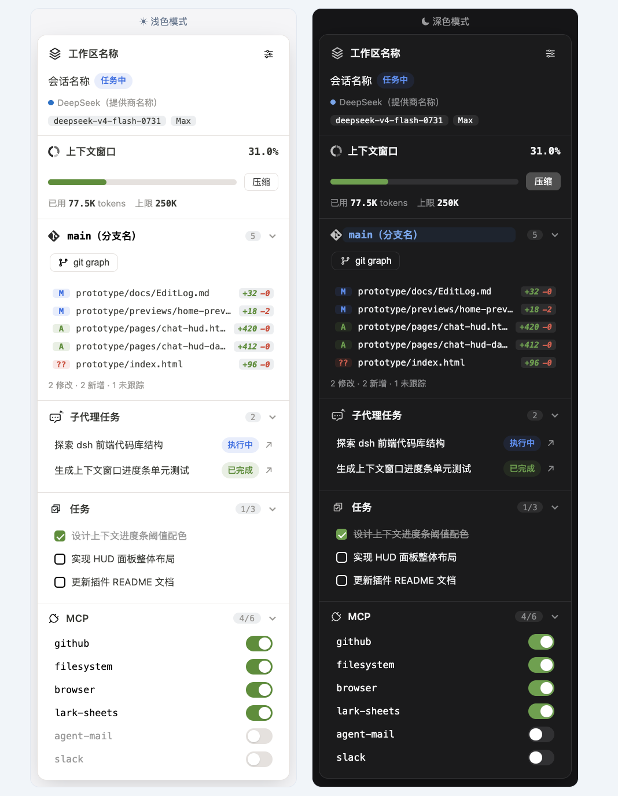

# dsh-awesome-hud

[](README.md)
[](README_en.md)

<div align="center">

# dsh-awesome-hud

为 DeepSeek Harness Web 聊天页打造的悬浮 HUD 面板：会话状态、上下文占用与一键压缩、git 变更、子代理、任务与 MCP 启停，一目了然。

[](LICENSE)



</div>

---

> [!NOTE]
> 一个 DSH Web 插件（`dsh.bundle.patch` 通道安装）。浏览页面右上角新增「HUD面板」按钮，点击开合悬浮面板；面板与 [dsh-better-sidebar](https://github.com/omdsh-dev/DSH-better-sidebar) 右侧栏互斥协作，互不遮挡。

## 📑 目录

- [✨ 功能列表](#-功能列表)
- [🚀 快速开始](#-快速开始)
- [🧭 使用说明](#-使用说明)
- [⚙️ 兼容性](#️-兼容性)
- [🔧 技术栈](#-技术栈)
- [🗺️ 路线图](#️-路线图)
- [📄 许可证](#-许可证)

---

## ✨ 功能列表

| 模块 | 说明 |
| --- | --- |
| 会话 | 当前工作区名称、会话名称、会话状态（任务中/待审批/空闲中/待回答/等待子任务）、模型提供商/模型名/推理等级；右上角「HUD 设置」勾选展示模块 |
| 上下文窗口 | 上下文占用进度条（0–40% 绿 / 40–90% 黄 / >90% 红）、已用/上限 tokens、一键「压缩」当前会话上下文 |
| git | 当前分支、变更文件数量、未提交文件及 `+xx/-xx` 行数、「git graph」弹窗（全引用最近 80 条）；仅在有 git 仓库时展示 |
| 子代理 | 当前会话全部后代子代理（按层级缩进）、执行中/已完成状态，点击跳转子代理会话页；仅在有子代理时展示 |
| 任务 | 当前会话待办任务列表、已完成/待完成状态与计数（如 `1/3`），随任务列表实时刷新；仅在有任务时展示 |
| MCP | 接入的全部 MCP 服务及 dsh 全局启用状态；开关直接启停 dsh 全局的 MCP 服务（写入 profile `cordis.patch.yml`），切换后页面刷新 |
| 用量 | DeepSeek 余额（充值+赠送合计）与 OpenCode Go 三个窗口用量百分比（oc-go 5h/1w/1m用量，仅百分比，复用 dsh-account-usage 插件数据，「跳转」直达开放平台）；DeepSeek 与 OpenCode Go 按各自配置独立展示——仅 DeepSeek 可用显示余额行，仅 opencode 订阅中显示用量三行，二者均未配置时模块隐藏 |

**互斥协作**：打开 better-sidebar 右侧边栏会自动关闭 HUD；手动关闭右侧边栏后 HUD 自动恢复。点击「HUD面板」按钮时若右侧边栏已打开，则先自动关闭侧边栏再打开 HUD（若版本兼容性导致自动关闭失败，HUD 会延迟到右侧边栏关闭后自动打开）。

## 🚀 快速开始

```bash
# 1. 安装（将 <absolute-path-to-plugin> 替换为本地源码目录绝对路径）
dsh plugin --profile web add dsh-awesome-hud@link:<absolute-path-to-plugin>

# 2. 重启 DSH Web 服务并刷新页面
```

安装完成后，聊天页右上角（「打开工作区」按钮左侧）出现「HUD面板」按钮，点击即可开合。

> [!NOTE]
> HUD 面板默认展开；再次点击按钮或刷新页面会记住上次的开合状态（localStorage）。模块可见性（除「会话」外的 5 个模块）保存在 DSH profile 设置中，跨浏览器/设备随 profile 同步。

## 🧭 使用说明

- **HUD 面板**：悬浮于聊天页右上角，宽度 300px，高度上限为输入框底部（面板撑满时底部与输入框底部平齐，且不超过聊天页可视高度，留 8px 底距），内容超出时面板内部滚动（滚动条仅在面板滚动时显示，停止 2s 后渐隐）；聊天内容与输入框随面板展开自动向左让位，不会重叠。
- **设置菜单**：「会话」模块右上角齿轮（主面板图标）打开菜单，可勾选展示「上下文窗口 / 用量 / git / 子代理任务 / 任务 / MCP」模块（用量仅在其可用时列出），底部「取消 / 确认」按钮丢弃或保存勾选；「会话」模块恒展示。
- **上下文窗口**：进度条颜色随占用率自动切换；「压缩」在会话空闲时可用，运行中按钮禁用并提示原因。
- **git 模块**：每 5 秒随面板打开自动刷新；「git graph」弹窗展示当前仓库（全部引用）最近 80 条提交图；HEAD 指向版本以放大的白色填充圆点 + 蓝色描边标记（原「HEAD」徽章已移除）。
- **MCP 模块**：开关控制 dsh 全局的 MCP 服务启停（写入 profile `cordis.patch.yml` 的 `dsh-awesome-hud mcp states` 块）；切换后页面自动刷新生效；模块默认展开。无任何 MCP 服务时模块仍展示空状态。
- **用量模块**：位于「上下文窗口」模块下方。数据复用 dsh-account-usage 插件路由（host 侧各有 30s/60s 缓存），面板打开时立即加载、之后每 60 秒轮询；四行数据均缩进展示，行首分别带 DeepSeek / OpenCode Go 图标；模块支持折叠，默认展开（折叠状态经 localStorage 持久化）。
  - **DeepSeek 余额**：展示余额合计（充值 + 赠送），「跳转」按钮弹出选择菜单，可跳转 deepseek 开放平台或 opencode go 用量页；仅当已配置 `DEEPSEEK_PLATFORM_TOKEN` 时展示该行。
  - **OpenCode Go 用量**：三行分别展示 oc-go 5h / 1w / 1m 窗口用量**百分比**；仅当已配置 OpenCode Go Key 且订阅有效（`/api/account-usage/opencode` 返回 `ok + keySource`）时展示；未配置 Key（`no-key`）或未订阅/订阅到期（`unauthorized`）时不展示。
  - **模块可见性**：DeepSeek 与 OpenCode Go 各自独立——仅 DeepSeek 可用只显示余额行；仅 OpenCode 订阅中只显示用量三行；二者均未配置时模块与设置项整体隐藏。
- **git 变更模块**：变更文件左侧状态标识按类型着色——修改 `M` 黄色、新增 `A` 蓝色、删除 `D` 红色、未跟踪 `?` 灰色（重命名 `R` / 复制 `C` 蓝色）。
- **图标**：设置菜单图标使用全不透明度主题色；深色模式下全部图标随主题反转显示。
- **折叠状态**：各模块折叠/展开状态刷新页面后保持（localStorage）；「会话」模块图标使用 DSH favicon。
- **新开会话页**：新建/空白会话（无会话记录）页面默认不展示 HUD；进入真实会话后自动恢复之前状态（不覆盖用户记忆）。

## ⚙️ 兼容性

| 项目 | 版本/说明 |
| --- | --- |
| DeepSeek Harness | `0.1.1-rc.2`（其余 rc 线未逐个验证；插件以可选服务 + 特征检测方式降级） |
| dsh-better-sidebar | `0.16.1`（通过公开服务 `ctx.betterSidebar` 监听面板状态；自动关闭依赖其折叠按钮 DOM 特征，失败时按「延迟打开」降级，不影响 HUD 独立使用） |
| 平台 | macOS 已验证；Windows/Linux 仅理论兼容（git 命令行为一致） |
| 主题 | 跟随深浅主题（使用 `--dsw-alias-*` 主题 token） |
| 语言 | 简体中文 / English，跟随 DSH locale |

## 🔧 技术栈

| 类别 | 内容 |
| --- | --- |
| Host 侧 | Node.js ESM、`ctx.webServer` 前缀路由、`ctx.settings`、`ctx.tools.guard`、`ctx.subagents`、`ctx.compaction`、`ctx.subprocess` |
| Client 侧 | 原生 JavaScript ModuleLoader bundle、React（`react.createElement`）、Cordis Slots（`conversation.session.header.utilities` / `shell.overlay`）、CSS 主题变量 |
| 数据来源 | 客户端会话投影（`ctx.sessions.list` / `workspaces` / `modelDirectories`）+ 自有 host API（git / MCP / 子代理 / 压缩）+ dsh-account-usage 余额/用量路由（复用） |
| 测试 | `node --test`（git 解析、MCP 解析、状态推导、设置收敛、信任围栏；位于 `test/`） |

## 🗺️ 路线图

- [x] 「HUD面板」头部按钮与面板开合
- [x] 会话 / 上下文窗口 / git / 子代理 / 任务 / MCP / 用量 七个模块
- [x] 与 dsh-better-sidebar 右侧栏互斥协作
- [x] HUD 设置菜单（host settings 持久化）
- [x] 浅/深主题与中英文双语
- [ ] 面板宽度拖拽调节（暂定：固定 300px）

## 📄 许可证

[MIT](LICENSE)
