# dsh-awesome-hud

[](README.md)
[](README_en.md)

[](LICENSE)

为 DeepSeek Harness Web 聊天页打造的悬浮 HUD 面板：会话状态、上下文占用与一键压缩、git 变更、子代理、任务与 MCP 启停，一目了然。

HUD在dsh中的效果（浅色主题）

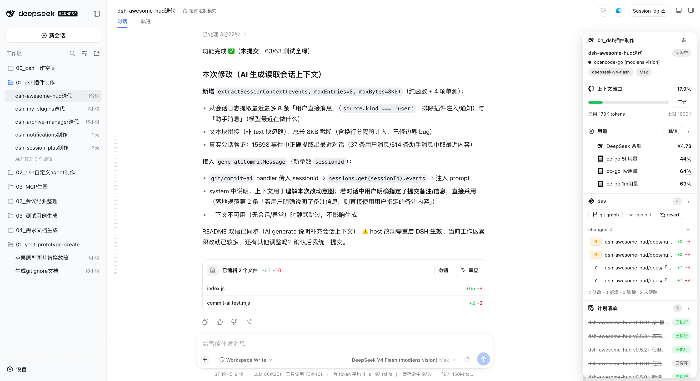

HUD在dsh中的效果（深色主题）

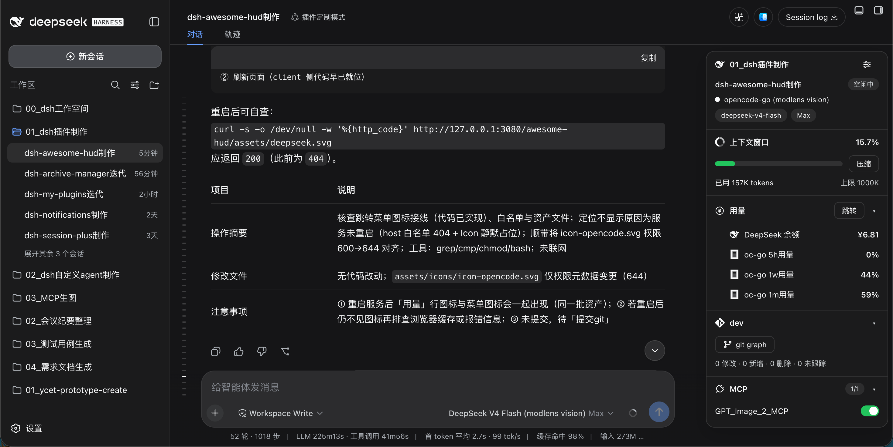

---

> [!NOTE]
> 一个 DSH Web 插件（`dsh.bundle.patch` 通道安装）。浏览页面右上角新增「HUD面板」按钮，点击开合悬浮面板；面板与 [dsh-better-sidebar](https://github.com/omdsh-dev/DSH-better-sidebar) 右侧栏互斥协作，互不遮挡。

## 📑 目录

- [✨ 功能列表](#-功能列表)
- [🚀 快速开始](#-快速开始)
- [🧭 使用说明](#-使用说明)
- [🖼️ 界面截图](#️-界面截图)
- [⚙️ 兼容性](#️-兼容性)
- [🔧 技术栈](#-技术栈)
- [📄 许可证](#-许可证)

---

## ✨ 功能列表

| 模块       | 说明                                                                                                                                                                                                |
| ---------- | --------------------------------------------------------------------------------------------------------------------------------------------------------------------------------------------------- |
| 会话       | 当前工作区名称、会话名称、会话状态（任务中/待审批/空闲中/待回答/等待子任务）、模型提供商/模型名/推理等级；右上角「HUD 设置」勾选展示模块                                                            |
| 上下文窗口 | 上下文占用进度条（0–40% 绿 / 40–90% 黄 / >90% 红）、已用/上限 tokens、一键「压缩」当前会话上下文                                                                                                  |
| 用量       | DeepSeek 余额（充值+赠送合计）与 OpenCode Go 三个窗口用量百分比（oc-go 5h/1w/1m用量），行首带图标并缩进，点击具体数值直达设置面板「账户」分区对应标签页；DeepSeek 与 OpenCode Go 按各自配置独立展示 |
| git        | 当前分支、变更文件数量；变更文件按暂存区（staged）与未暂存区（changes）分组展示（组名带灰色计数，无文件的分组自动隐藏）；文件行点击可暂存/移除暂存/撤销；「commit」提交暂存区（手动输入或 AI 生成提交信息——按内置本地 git 提交规范 [YYMMDD] 项目名 vX.Y.Z：内容），「revert」撤销全部未暂存变更（破坏性操作均有二次确认与受影响文件清单）；「git graph」弹窗（全引用最近 80 条）；仅在有 git 仓库时展示 |
| 子代理任务 | 当前会话全部后代子代理（按层级缩进）、执行中（黄）/已完成（绿）状态，点击跳转子代理会话页；仅在有子代理时展示                                                                                       |
| 任务       | 当前会话待办任务列表、已完成/待完成状态与计数（如`1/3`），随任务列表实时刷新；进行中任务显示旋转动画图标，底部展示「已完成/进行中/待处理」三态计数（含 0 恒显）；仅在有任务时展示                                             |
| 计划清单   | 当前会话通过 plan 模式（`exit_plan_mode`）产出的全部计划：待审批（黄）/已执行（绿）/已废弃（灰、划线淡色）三态标签，标题栏展示计划总数，点击行弹出计划全文弹窗，模块底部展示「已执行/待审批/已废弃」三态计数（含 0 恒显）；仅在有计划记录时展示                             |
| MCP        | 接入的全部 MCP 服务及 dsh 全局启用状态；开关直接启停 dsh 全局的 MCP 服务（写入 profile`cordis.patch.yml`），切换后页面刷新                                                                        |

**互斥协作**：打开 better-sidebar 右侧边栏会自动关闭 HUD；手动关闭右侧边栏后 HUD 自动恢复。点击「HUD面板」按钮时若右侧边栏已打开，则先自动关闭侧边栏再打开 HUD（若版本兼容性导致自动关闭失败，HUD 会延迟到右侧边栏关闭后自动打开）。

## 🚀 快速开始

**方式一：从 GitHub 远程安装（推荐）**

```bash
# 1. 安装（要求本机 git 可访问 GitHub）
dsh plugin --profile web add github:Ycet/dsh-awesome-hud

# 2. 重启 DSH Web 服务并刷新页面
```

**方式二：从本地源码安装（开发）**

```bash
# 1. 安装（将 <absolute-path-to-plugin> 替换为本地源码目录绝对路径）
dsh plugin --profile web add dsh-awesome-hud@link:<absolute-path-to-plugin>

# 2. 重启 DSH Web 服务并刷新页面
```

安装完成后，聊天页右上角（「打开工作区」按钮左侧）出现「HUD面板」按钮，点击即可开合。

> [!NOTE]
> HUD 面板默认展开；再次点击按钮或刷新页面会记住上次的开合状态（localStorage）。模块可见性保存于 DSH profile 设置中，跨浏览器/设备随 profile 同步。

## 🧭 使用说明

- **HUD 面板**：悬浮于聊天页右上角，宽度 300px，高度上限为输入框底部（留 8px 底距），内容超出时面板内部滚动（滚动条仅在滚动时显示，停止 2s 后渐隐）；聊天内容与输入框随面板展开自动向左让位，不会重叠。
- **设置菜单**：「会话」模块右上角齿轮打开菜单，可勾选展示「上下文窗口 / 用量 / git / 子代理任务 / 任务 / 计划清单 / MCP」模块（用量仅在其可用时列出），底部「取消 / 确认」按钮丢弃或保存勾选；「会话」模块恒展示。用量可用时，菜单内额外提供「用量模块内容」分组，可分别开关 DeepSeek 余额与 OpenCode Go 用量两行组的展示。
- **上下文窗口**：进度条颜色随占用率自动切换；「压缩」在会话空闲时可用，运行中按钮禁用并提示原因。
- **用量模块**：位于「上下文窗口」模块下方。数据复用 dsh-account-usage 插件路由（host 侧各有 30s/60s 缓存），面板打开时立即加载、之后每 60 秒轮询；四行数据均缩进展示，行首分别带 DeepSeek / OpenCode Go 图标；模块支持折叠，默认展开（折叠状态经 localStorage 持久化）。
  - **DeepSeek 余额**：展示余额合计（充值 + 赠送），「跳转」按钮弹出选择菜单，可跳转 deepseek 开放平台或 opencode go 用量页；**点击具体余额数值**可直接打开设置面板「账户」分区的 deepseek 标签页；仅当已配置 `DEEPSEEK_PLATFORM_TOKEN` 时展示该行。
  - **OpenCode Go 用量**：三行分别展示 oc-go 5h / 1w / 1m 窗口用量**百分比**，**点击具体百分比数值**可直接打开设置面板「账户」分区的 opencode go 标签页；仅当已配置 OpenCode Go Key 且订阅有效（`/api/account-usage/opencode` 返回 `ok + keySource`）时展示。
  - **模块可见性与可配置内容**：DeepSeek 与 OpenCode Go 各自独立——仅 DeepSeek 可用只显示余额行，仅 OpenCode 订阅中只显示用量三行，二者均未配置时模块与设置项整体隐藏；展示内容可在「用量模块内容」分组中单独开关（host settings 持久化，随 profile 同步）。
- **git 模块**：每 5 秒随面板打开自动刷新（写操作后立即刷新）；「git graph」弹窗展示当前仓库（全部引用）最近 80 条提交图；HEAD 指向版本以放大的白色填充圆点 + 蓝色描边标记；变更文件按分组展示（状态字母按类型着色——修改 `M` 黄色、新增 `A` 蓝色、删除 `D` 红色、未跟踪 `?` 灰色，重命名 `R` / 复制 `C` 蓝色）：
  - **分组**：staged（暂存区）与 changes（未暂存区，含未跟踪）两组，组名右侧灰色数字为组内文件数；某组无文件时该组不展示
  - **文件行操作**：点击任一文件行弹出选项菜单——staged 组文件提供「remove from stage」（移出暂存区）；changes 组文件提供「add to stage」（暂存该文件）与「revert」（撤销该文件变更；未跟踪新建文件撤销 = 删除该文件，均带二次确认与受影响文件清单）
  - **commit**：按钮在暂存区无文件时置灰；点击弹出提交弹窗（展示待提交暂存文件数量 + 单行输入框 + AI generate + commit），输入为空时 commit 置灰；提交范围仅为暂存区
  - **AI generate**：使用当前会话所选模型，结合暂存区全部 diff（超 16KB 截断），按内置本地 git 提交规范生成提交信息并填入输入框——格式 [YYMMDD] 开发项目名称 vX.Y.Z：修改内容（日期取系统当前时间；版本号依规范自动判断：破坏性变更→主版本、向后兼容新功能→次版本、修复/文档→修订号；项目名与当前版本取自工作区向上最近的 package.json）
  - **revert**：按钮在无「已跟踪文件的未暂存变更」时置灰；点击后二次确认弹窗列出将撤销的全部文件，确认后仅还原已跟踪文件的未暂存变更（未跟踪新建文件保留、暂存区不受影响）
- **子代理任务模块**：按层级缩进展示全部后代子代理；执行中状态徽章为**黄色**，已完成为绿色；点击条目跳转对应子代理会话页。
- **任务模块**：列表展示当前会话待办任务；进行中（in progress）任务行首为旋转动画图标（DeepSeek 官方同款，1s/圈，品牌蓝），已完成/待处理保持勾选与待办图标；模块底部展示「x 已完成 · x 进行中 · x 待处理」三态计数（含 0 恒显），标题栏保留「已完成/总数」计数。
- **计划清单模块**：位于「任务」模块下方，展示当前会话通过 plan 模式产出的全部计划清单（新→旧），仅在存在计划记录时展示；每 5 秒随面板打开自动刷新，状态由会话日志自动推导：
  - **待审批**（黄色标签）：计划刚产出、用户尚未审批；
  - **已执行**（绿色标签）：用户在计划审查中审批通过（`exit_plan_mode` 成功返回）；
  - **已废弃**（灰色标签、文字划线变淡）：用户拒审/要求修改/打断审查，或计划无审批结论但 plan 模式随后退出（如 `/plan off`）；
  - 行主文字取计划首个 Markdown 标题，无标题时截取正文；点击任一行弹出计划全文弹窗（标题、状态、产出时间与正文，正文按轻量 Markdown 渲染，支持标题/列表/代码块/链接/引用与 GFM 表格）；模块底部展示「x 已执行 · x 待审批 · x 已废弃」三态计数（含 0 恒显）；模块可折叠，默认展开。
- **MCP 模块**：开关控制 dsh 全局的 MCP 服务启停；切换后页面自动刷新生效；模块默认展开，无任何 MCP 服务时仍展示空状态。
- **折叠状态**：各模块折叠/展开状态刷新页面后保持（localStorage）；「会话」模块图标使用 DSH favicon。
- **新开会话页**：新建/空白会话（无会话记录）页面默认不展示 HUD；进入真实会话后自动恢复之前状态（不覆盖用户记忆）。

## 🖼️ 界面截图

### 各模块预览

#### HUD 设置菜单

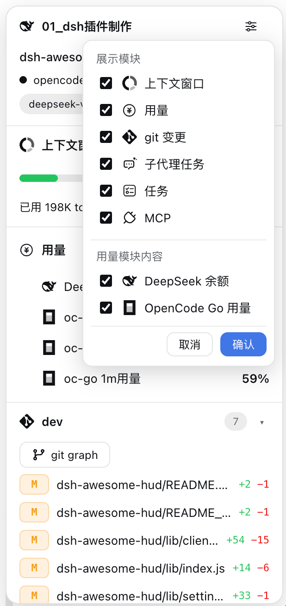

#### 「会话」模块

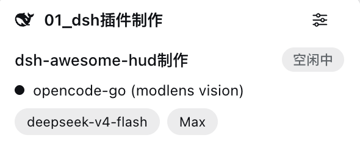

#### 「上下文窗口」模块

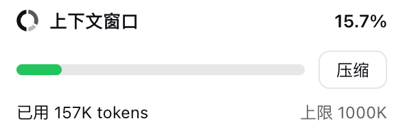

#### 「用量」模块

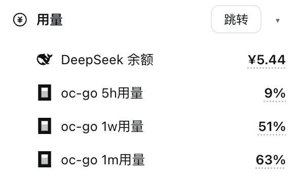

#### 「git变更」模块

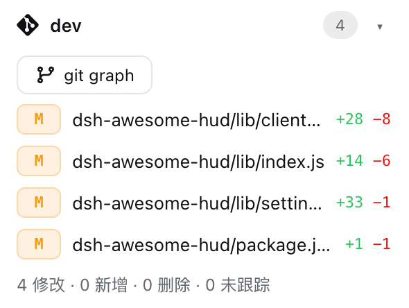

#### 「子代理任务」模块

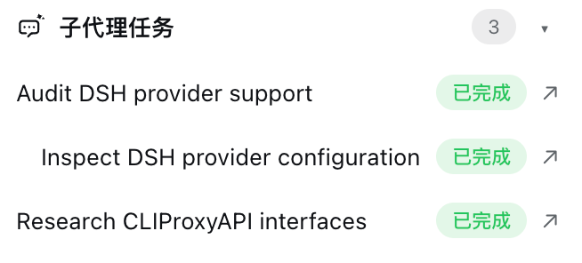

#### 「任务」模块

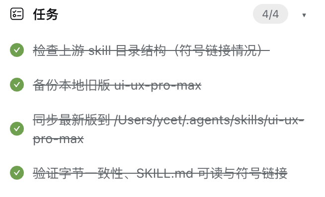

#### 「计划清单」模块

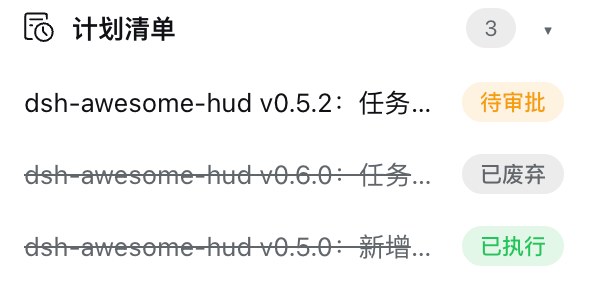

#### 「MCP」模块

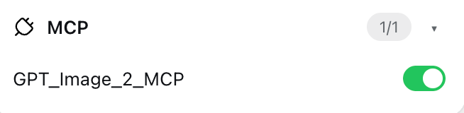

### 其他界面

#### 「git graph」界面

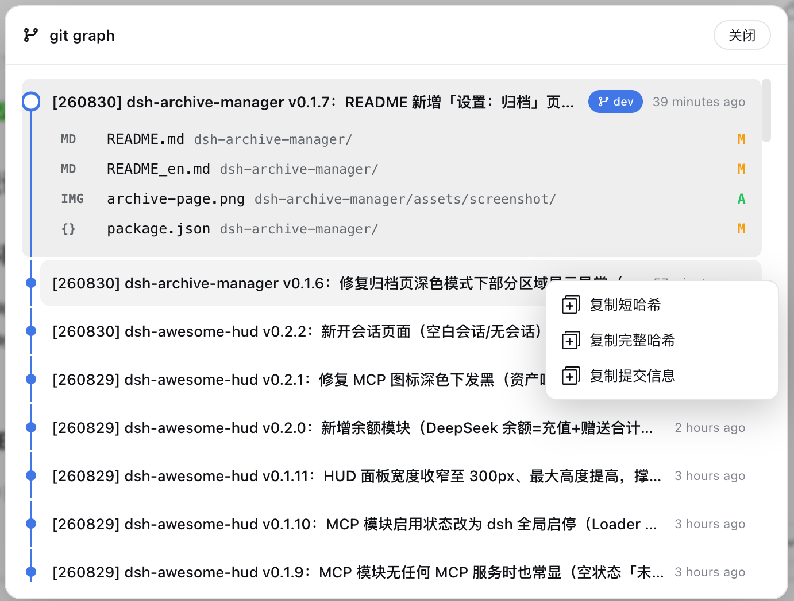

#### 「计划清单」界面

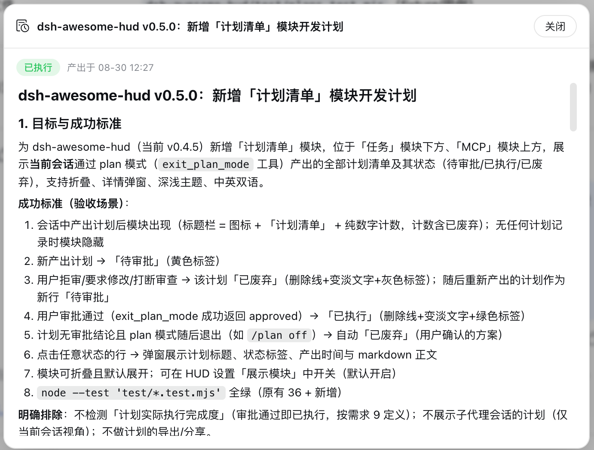

## ⚙️ 兼容性

| 项目               | 版本/说明                                                                                                                                     |
| ------------------ | --------------------------------------------------------------------------------------------------------------------------------------------- |
| DeepSeek Harness   | `0.1.1-rc.2`（其余 rc 线未逐个验证；插件以可选服务 + 特征检测方式降级）                                                                     |
| dsh-plan-mode      | 计划清单数据源：会话日志 `exit_plan_mode` 工具调用（`tool/call`/`tool/result`/`plan/mode` 事件）；上游审批语义变更时需复查状态推导                                            |
| dsh-better-sidebar | `0.16.1`（通过公开服务 `ctx.betterSidebar` 监听面板状态；自动关闭依赖其折叠按钮 DOM 特征，失败时按「延迟打开」降级，不影响 HUD 独立使用） |
| 平台               | macOS 已验证；Windows/Linux 仅理论兼容（git 命令行为一致）                                                                                    |
| 主题               | 跟随深浅主题（使用`--dsw-alias-*` 主题 token）                                                                                              |
| 语言               | 简体中文 / English，跟随 DSH locale                                                                                                           |

## 🔧 技术栈

| 类别      | 内容                                                                                                                                                                 |
| --------- | -------------------------------------------------------------------------------------------------------------------------------------------------------------------- |
| Host 侧   | Node.js ESM、`ctx.webServer` 前缀路由、`ctx.settings`、`ctx.tools.guard`、`ctx.subagents`、`ctx.compaction`、`ctx.subprocess`、`ctx.llm`（AI 生成提交信息）                            |
| Client 侧 | 原生 JavaScript ModuleLoader bundle、React（`react.createElement`）、Cordis Slots（`conversation.session.header.utilities` / `shell.overlay`）、CSS 主题变量   |
| 数据来源  | 客户端会话投影（`ctx.sessions.list` / `workspaces` / `modelDirectories`）+ 自有 host API（git / MCP / 子代理 / 计划清单 / 压缩）+ dsh-account-usage 余额/用量路由（复用） |
| 测试      | `node --test`（git 解析、MCP 解析、状态推导、计划清单推导、设置收敛、信任围栏；位于 `test/`）                                                                        |

## 📄 许可证

[MIT](LICENSE)
