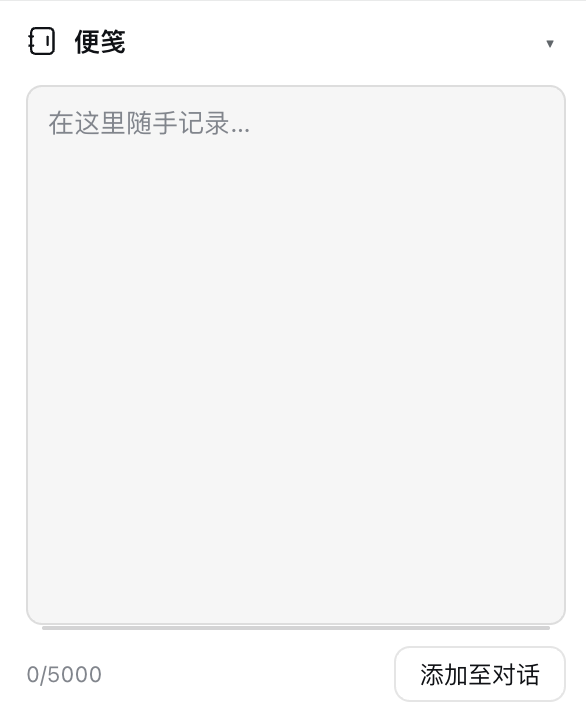
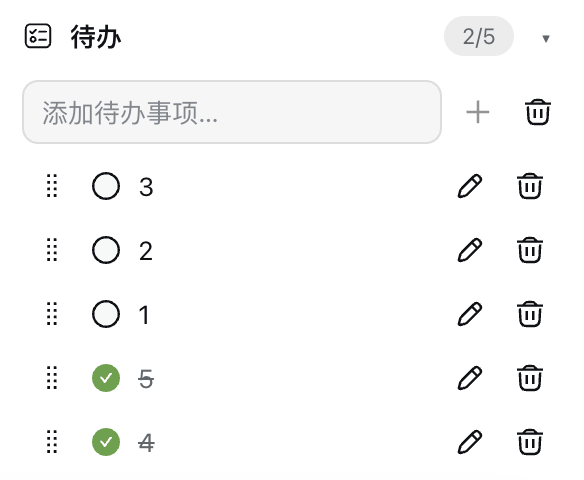
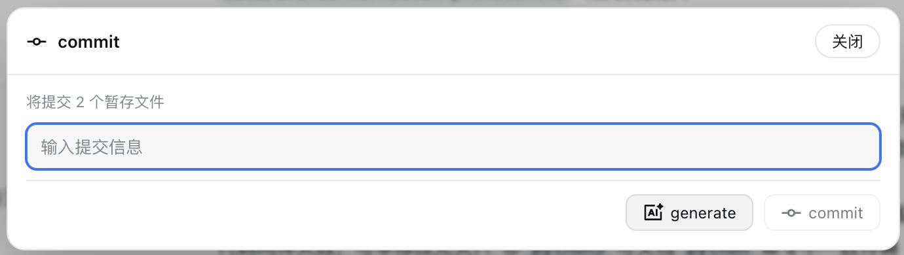

# dsh-awesome-hud

[](README.md)
[](README_en.md)

[](LICENSE)

A floating HUD panel for the DeepSeek Harness web chat: session state, context usage with one-click compaction, git changes, subagents, tasks, and MCP toggles — all at a glance.

HUD in DSH (light theme)


HUD in DSH (dark theme)


---

> [!NOTE]
> A DSH Web plugin installed through the `dsh.bundle.patch` channel. A new "HUD panel" button appears at the top-right of the chat page; the floating panel cooperates with the [dsh-better-sidebar](https://github.com/omdsh-dev/DSH-better-sidebar) right sidebar so the two never overlap.

## 📑 Table of Contents

- [✨ Features](#-features)
- [🚀 Quick Start](#-quick-start)
- [🧭 Usage](#-usage)
- [🖼️ Screenshots](#️-screenshots)
- [⚙️ Compatibility](#️-compatibility)
- [🔧 Tech Stack](#-tech-stack)
- [⬆️ Upgrade Notes (v0.11.x → v0.13.0)](#️-upgrade-notes-v011x--v0130)
- [📄 License](#-license)

---

## ✨ Features

| Module         | Description                                                                                                                                                                                                                                                                                                                                                                                                                                                                                                                                                                                                                                                                                                                                                                                  |
| -------------- | -------------------------------------------------------------------------------------------------------------------------------------------------------------------------------------------------------------------------------------------------------------------------------------------------------------------------------------------------------------------------------------------------------------------------------------------------------------------------------------------------------------------------------------------------------------------------------------------------------------------------------------------------------------------------------------------------------------------------------------------------------------------------------------------- |
| Session        | Current workspace name, session name, session state (Running / Awaiting approval / Idle / Awaiting answer / Waiting for subagents), model provider, model, reasoning effort; a pencil button to the right of the session name allows renaming (click to enter edit mode with input + cancel/confirm, confirm saves and auto-updates the session list title); the gear at its top-right opens HUD settings                                                                                                                                                                                                                                                                                                                                                                                                                                                                                                                                                                    |
| Context window | Context occupancy bar (0–40% green / 40–90% yellow / >90% red), footer with “n used · n limit · n% cache hit” (cache-hit rate is shown to one decimal place; `—` when unavailable), and one-click "Compact" for the current session                                                                                                                                                                                                                                                                                                                                                                                                                                                                                                                                                 |
| Usage          | DeepSeek balance, OpenCode Go percentage usage for the 5h/1w/1m windows, and Codex 5-hour/weekly remaining-quota percentages (plus a `Codex gpt-reserve quota` row in the same style whenever `dsh-codex-subscription` reports a gpt-reserve quota), led by matching icons and indented; clicking a figure opens the matching settings page; DeepSeek, OpenCode Go, and Codex render independently according to installation/sign-in state                                                                                                                                                                                                                                                                                                                                                                                                                                                                                                                    |
| git            | Current branch (branch button at the right of the git title bar: a dropdown to switch existing branches — current branch highlighted with a check — or type a new name and click "Add" to create and auto-switch), changed-file counts; changed files grouped into staged / changes (group names with gray counts, empty groups hidden); clicking a file row stages / unstages / reverts it; the "commit" button commits the staged area (manual input or an AI-generated message that follows the built-in local git convention [YYMMDD] project vX.Y.Z: summary) and "revert" discards all unstaged changes (tracked files are restored and untracked new files are deleted; destructive actions all require a confirmation dialog listing affected files); the "git graph" popup (commits across all refs shown in pages of up to 80 each, with a "Load more" button at the bottom of the list appending the next page until the full history is loaded; the current branch uses a blue-filled white label and other branches use gray-filled black labels); right-clicking a commit row opens a menu — copy short hash (7 chars) / full hash (40 chars) / commit subject, merge into the current branch, or soft / mixed / hard reset, with an inline second confirmation for merge and reset operations; shown only within a git repository |
| Subagents      | All descendant subagents of the session (indented by depth) with running (yellow) / done (green) states; clicking an entry opens the subagent session; shown only when subagents exist                                                                                                                                                                                                                                                                                                                                                                                                                                                                                                                                                                                                       |
| Tasks          | To-do list of the current session with done/pending states and a counter (e.g.`1/3`), refreshing live; in-progress tasks show a spinning animated icon and the bottom row shows the completed / in progress / pending counts (all three shown even at zero); shown only when tasks exist                                                                                                                                                                                                                                                                                                                                                                                                                                                                                                   |
| Plan list      | Every plan produced by plan mode (`exit_plan_mode`) in the current session, with three-state badges — pending review (yellow) / approved (green) / discarded (gray, struck-through dimmed text) — the header shows the total count, clicking a row opens the full plan, and the bottom row shows the approved / pending review / discarded counts (all three shown even at zero); shown only when plans exist                                                                                                                                                                                                                                                                                                                                                                            |
| MCP            | All connected MCP servers with their DSH-global enabled state; the switch toggles DSH-global MCP servers (written to the`cordis.patch.yml` block), refreshing the page after the change                                                                                                                                                                                                                                                                                                                                                                                                                                                                                                                                                                                                    |

| Notes         | **Workspace-shared** notepad (all sessions under the same workspace directory share one note, persisted locally); a drag handle at the bottom of the input adjusts height (persisted in real time), 5000-char limit with a live counter, a side dot indicates content exists; one-click adds the full note text to the conversation composer; collapsible/expandable (state persisted)                                                                                                                                                                                                                                                                                                                                                                                                        |
| Todo          | **Workspace-shared** to-do list (all sessions under the same workspace directory share one list and its order, persisted locally); check/uncheck complete, add/delete items, drag-to-reorder whole rows (drag handle at the far left before the checkbox), one-click clear completed (confirmation dialog, button disabled when no completed items); bottom shows completion count; one-click adds all todos to the conversation composer; collapsible/expandable (state persisted)                                                                                                                                                                                                                                                                                                              |

**Mutual exclusion**: opening the better-sidebar right sidebar closes the HUD; closing the sidebar restores it. Clicking the "HUD panel" button while the sidebar is open closes the sidebar first, then opens the HUD (if the auto-close fails due to version compatibility, the HUD opens as soon as the sidebar is closed).

## 🚀 Quick Start

**Option 1: install from GitHub remotely (recommended)**

```bash
# 1. Install (requires git access to GitHub on this machine)
dsh plugin --profile web add github:Ycet/dsh-awesome-hud

# 2. Restart the DSH Web service and refresh the page
```

**Option 2: install from local source (development)**

```bash
# 1. Install (replace <absolute-path-to-plugin> with your local source directory)
dsh plugin --profile web add dsh-awesome-hud@link:<absolute-path-to-plugin>

# 2. Restart the DSH Web service and refresh the page
```

After installation, a "HUD panel" button appears at the top-right of the chat page (left of the "Open workspace" button); click it to toggle the panel.

> [!NOTE]
> The HUD panel is expanded by default, and **each session remembers its own open/closed state** (stored per session id in localStorage): collapsing it in session A never affects session B. **The blank/new-session page is the exception**: it always starts collapsed (in-memory only — nothing is written to localStorage, so no session's memory is touched) and offers its own floating "HUD panel" button in the top-right for opening it on that page. Module visibility is stored in the DSH profile settings and syncs across browsers/devices with the profile.

## 🧭 Usage

- **HUD panel**: floats at the top-right of the chat page, 300px wide; its height is capped at the composer's bottom edge (with an 8px bottom margin) and scrolls internally when content overflows (the scrollbar appears only while scrolling and fades out 2s after scrolling stops); chat content and the composer automatically shift left so nothing overlaps.
- **Settings menu**: the gear at the top-right of the Session module opens a menu to toggle "Context window / Usage / git / Subagents / Tasks / Plan list / MCP" modules (Usage is listed only when available), with "Cancel / Confirm" buttons at the bottom; the Session module is always shown. When Usage is available, the menu also shows a "Usage module content" group to independently show/hide the DeepSeek balance, OpenCode Go usage, and Codex quota row groups.
- **Session module**: a pencil button to the right of the session name allows renaming — click to enter edit mode (input + cancel/confirm icon buttons), Enter to submit, Esc to cancel, confirm is disabled while the input is empty; on confirm the new name is saved and the session list title auto-updates.
- **Context window**: the bar color switches automatically with occupancy; its footer reads “n used · n limit · n% cache hit”, with the cache-hit rate fixed to one decimal place (`—` when no statistic is available); "Compact" is available while the session is idle and disabled with a reason while it runs.
- **Usage module**: sits below the Context window module. DeepSeek/OpenCode Go reuse the dsh-account-usage routes, while Codex uses the dsh-codex-subscription browser RPC; loads immediately when the panel opens and polls every 60 seconds; rows are indented and led by their matching icons; the module is collapsible and expanded by default (fold state persists in localStorage).
  - **DeepSeek balance**: shows the total (top-up + granted); the "Open" button pops up a menu to jump to the deepseek open platform or the opencode go usage page; **clicking the balance figure** opens the deepseek tab of the settings Account page directly; this row appears only when `DEEPSEEK_PLATFORM_TOKEN` is configured.
  - **OpenCode Go usage**: three rows showing the **percentage** of the oc-go 5h / 1w / 1m windows; **clicking a percentage** opens the opencode go tab of the settings Account page directly; shown only with a configured OpenCode Go Key and an active subscription (the `/api/account-usage/opencode` route returns `ok + keySource`).
  - **Codex quota**: two rows, `Codex 5h quota` and `Codex weekly quota`, showing **integer remaining percentages** with the ChatGPT icon; **clicking a percentage** opens the "Codex subscription" settings page. The rows appear only when `dsh-codex-subscription` is installed and signed in; after a confirmed sign-in, temporary quota failures keep the rows visible as `—`, while an unavailable sign-in state hides them.
  - **gpt-reserve quota**: when `dsh-codex-subscription` reports a gpt-reserve quota (the `additional_rate_limits` entry of `/wham/usage` whose `id` is `base_model_inference` and whose `limit_name`/`name` is `gpt-reserve`; the plugin matches **either id or name**, normalized across case, underscores, hyphens and spaces), a `Codex gpt-reserve quota` row is appended below the weekly row with the **exact same style, icon and interaction** as the 5h/weekly rows (its primary window's remaining percentage; a named quota renders as `Codex gpt-reserve quota (name)`). When the quota is absent the row is **not rendered**; when it exists but its window data is malformed the row stays with `—`.
  - **Module visibility & configurability**: DeepSeek, OpenCode Go, and Codex are independent — each data source shows only its own rows, and the module (plus its settings row) hides when none is available; the displayed content can be toggled independently in the "Usage module content" group (persisted in host settings, synced with the profile).
- **git module**: refreshes every 5 seconds while the panel is open (immediately after write operations); the branch button at the right of the title bar opens a dropdown — switch existing branches (current branch highlighted with a check) or type a new name and click "Add" to create and auto-switch; the "git graph" popup shows commits across all refs in pages of up to 80 per page — scrolling to the bottom reveals a "Load more" button that appends the next page, until the full history is loaded (an "All commits loaded" hint then appears at the end of the list); the current-branch label is blue with white text and other branch labels are gray with black text; the HEAD commit is marked with an enlarged white-filled, blue-stroked dot. Right-clicking a commit row opens a menu to copy the short hash (7 chars) / full hash (40 chars) / commit subject, plus these protected operations:
  - **Merge into current branch**: the menu item is first replaced in place with inline “Confirm? / Cancel” controls; confirmation runs `git merge --no-edit`. Already-up-to-date, local-changes block, and conflict auto-abort with a file list are all handled with friendly toasts.
  - **reset (soft) — keep staged**: available only for a commit before HEAD in the currently checked-out local branch history. After secondary confirmation, `git reset --soft` rolls back to it and keeps the contents of later commits staged.
  - **reset (mixed) — unstage changes**: under the same branch-history restriction, secondary confirmation runs `git reset --mixed`, keeping the contents of later commits in the working tree but unstaged.
  - **reset (hard) — discard changes**: after secondary confirmation, `git reset --hard` rolls back to the selected commit and discards the contents of later commits plus uncommitted changes to tracked files; untracked files are retained.
  - Reset is unavailable with no checked-out local branch, while another Git operation is in progress, when the selected commit is outside the current branch history, or when it is already HEAD. Changed files are grouped and shown with status letters colored by type — modified `M` yellow, added `A` blue, deleted `D` red, untracked `?` gray (renamed `R` / copied `C` blue):
  - **Groups**: `staged` and `changes` (includes untracked) with a gray per-file count next to each group name plus one-click buttons: "+" on changes stages every unstaged file, "-" on staged unstages every staged file; a group hides when it has no files
  - **File row actions**: clicking any file row opens an action menu — staged files offer "remove from stage"; changes files offer "add to stage" and "revert" (reverting an untracked new file deletes it; every destructive action requires a confirmation dialog listing affected files)
  - **commit**: disabled while nothing is staged; opens a dialog with the number of staged files to commit, a multi-line input, AI generate and commit buttons; commit is disabled while the input is empty; Enter inserts a newline, and only the commit button submits; only the staged area is committed
  - **AI generate**: uses the model selected in the current session with the full staged diff (truncated over 16 KB) and the recent conversation context of the current session (direct user messages and assistant replies — a commit note explicitly specified by the user in the conversation is used verbatim), generating the message per the built-in local git commit convention — `[YYMMDD] project-name vX.Y.Z: summary` (date = current system time; version bumped strictly by the rules: breaking change → major, backward-compatible feature → minor, fix/docs → patch; project name and current version come from the nearest package.json above the workspace); afterwards the result is validated — the version must be strictly greater than the current one, otherwise it regenerates once (with the previous output and the failure reason as feedback) and, if it still fails, fills the message in anyway and warns you to verify it
  - **revert**: disabled when there are no unstaged changes (including untracked); the confirmation dialog lists every affected file (untracked files prefixed with `?`); after confirmation, unstaged changes of tracked files are reverted and untracked new files are deleted (the staged area is untouched)
- **Subagents module**: lists every descendant subagent indented by depth; running entries show a **yellow** badge and done entries green; clicking an entry opens the corresponding subagent session.
- **Tasks module**: lists the current session's pending tasks; in-progress tasks show the official DSH spinning ring icon (1s/rev, brand blue), while completed/pending keep the check and to-do icons; the bottom of the module shows "x completed · x in progress · x pending" counts (all three always shown, including zeros), and the header keeps the "completed/total" counter.
- **Plan list module**: sits below the Tasks module and lists every plan produced by plan mode in the current session (newest first); it appears only when plans exist and refreshes every 5 seconds while the panel is open. States are derived automatically from the session log:
  - **Pending review** (yellow badge): the plan was just produced and the user has not approved it yet;
  - **Approved** (green badge): the user approved it in the plan review (`exit_plan_mode` succeeded);
  - **Discarded** (gray badge, struck-through dimmed text): the user rejected it / asked for changes / interrupted the review, or the plan received no approval outcome while plan mode was later exited (e.g. `/plan off`);
  - The row label is the plan's first Markdown heading, falling back to an excerpt of the body; clicking any row opens a modal with the plan's title, state, creation time and body (lightweight Markdown rendering: headings, lists, code blocks, links, quotes and GFM tables). The bottom of the module shows "x approved · x pending review · x discarded" counts (all three always shown, including zeros). The module is collapsible and expanded by default.
- **MCP module**: toggles DSH-global MCP server state; the page auto-refreshes after the change; the module is expanded by default and stays visible with an empty state when no MCP server exists.
- **Notes module**: a **workspace-shared** notepad — keyed by the session's workspace directory, so every session under that directory shares one note (including the input height), persisted locally; deleting or archiving any/all sessions never affects the note, and a new session created later in the same workspace still finds it; the drag handle at the bottom of the input adjusts height (persisted in real time), with a 5000-char limit and a live counter; a side dot indicates the note has content; one-click adds the full note text to the conversation composer (on a blank session page it targets the workspace's most recent session); the module is collapsible/expandable (state persisted). Sessions with no workspace (`cwd`) fall back to session-local isolation instead of sharing.
- **Todo module**: a **workspace-shared** to-do list — keyed by the session's workspace directory, so every session under it shares one list and its order (persisted locally); check/uncheck complete, add/delete items, drag-to-reorder whole rows (drag handle at the far left before the checkbox), one-click clear completed (confirmation dialog, button disabled when no completed items); the bottom shows a completion count; one-click adds all todos to the conversation composer; the module is collapsible/expandable (state persisted). Concurrent edits from several sessions/tabs in the same workspace are merged by item id instead of overwriting each other.
- **Fold state**: each module's collapsed/expanded state survives page refreshes (localStorage); the Session module uses the DSH favicon.
- **Blank session page**: a floating "HUD panel" button appears in the **top-right of the viewport** (that page has no title bar, so this button is the entry point; it sits where the header button would be in a real session); the page always starts collapsed — click the button to expand it, and the panel keeps the **exact same position as in a real session** (fixed to the right edge, 300px wide) while the composer and page content shift left by ~300px to make room; **the button itself shifts left to sit beside the panel** (never overlapping) and returns to the top-right corner when collapsed; only modules with a data source on that page render (Session / Usage / Notes / Todo / MCP, plus git when the target workspace really is a git repository). Entering a real session loads that session's own open/closed memory, and the header button takes over.

## 🖼️ Screenshots

### Module Previews

#### Session module


#### Context window module


#### Usage module


#### git changes module


#### Subagents module


#### Tasks module


#### Plan list module


#### MCP module


#### Notes module



#### Todo module



### Other interfaces

#### HUD Settings


#### git graph interface


#### git commit interface



#### Plan content interface


## ⚙️ Compatibility

| Item               | Version / Notes                                                                                                                                                                                                           |
| ------------------ | ------------------------------------------------------------------------------------------------------------------------------------------------------------------------------------------------------------------------- |
| DeepSeek Harness   | `0.1.1-rc.2` (other rc lines not individually verified; the plugin degrades gracefully via optional services + feature detection)                                                                                       |
| dsh-plan-mode      | Data source of the Plan list:`exit_plan_mode` tool calls in the session log (`tool/call` / `tool/result` / `plan/mode` events); re-check the state derivation if the upstream review semantics change             |
| dsh-better-sidebar | `0.16.1` (listens to the panel state through the public `ctx.betterSidebar` service; auto-closing relies on the collapse button's DOM marker and falls back to a delayed open — the HUD works standalone regardless) |
| Platform           | macOS verified; Windows/Linux theoretically compatible (identical git command behavior)                                                                                                                                   |
| Theme              | Follows light/dark themes (uses`--dsw-alias-*` theme tokens)                                                                                                                                                            |
| Language           | Simplified Chinese / English, follows the DSH locale                                                                                                                                                                      |
| Data scope         | Notes and Todo are shared per workspace directory (`localStorage`); sessions without a `cwd` fall back to session-local isolation                                                                                        |
| Panel open state   | Persisted per session id in `dsh-awesome-hud:open` (a `{ "session id": "1"|"0" }` map); the blank session page never persists it                                                                                        |
| Panel open state   | Persisted per session id in `dsh-awesome-hud:open` (a `{ "session id": "1"|"0" }` map); the blank session page never persists it                                                                                        |

## 🔧 Tech Stack

| Category     | Content                                                                                                                                                                                                         |
| ------------ | --------------------------------------------------------------------------------------------------------------------------------------------------------------------------------------------------------------- |
| Host         | Node.js ESM,`ctx.webServer` prefix routes, `ctx.settings`, `ctx.tools.guard`, `ctx.subagents`, `ctx.compaction`, `ctx.subprocess`, `ctx.llm` (AI commit messages)                                 |
| Client       | Native JavaScript ModuleLoader bundle, React (`react.createElement`), Cordis Slots (`conversation.session.header.utilities` / `shell.overlay`), CSS theme variables; no new slot — the blank-session entry reuses `shell.overlay` |
| Data sources | Client-side session projection (`ctx.sessions.list` / `workspaces` / `modelDirectories`) + own host APIs (git / MCP / subagents / plan list / compaction) + reused dsh-account-usage balance/usage routes |
| Tests        | `node --test` (git parsing, MCP parsing, status derivation, plan-list derivation, settings normalization, trust fence; in `test/`)                                                                          |

## ⬆️ Upgrade Notes (v0.11.x → v0.13.0)

**The panel's open/closed state is now per session.** Older versions kept a single flag in `dsh-awesome-hud:open`; after the upgrade that value migrates to the first session you enter, while every other session starts expanded and keeps its own memory.

**The blank session page gained a floating entry point**, with the panel in the same position as in a real session (fixed to the right edge); that page always starts collapsed.

Notes and Todo moved from **session scope** to **workspace scope**. The first time the panel opens in a workspace after the upgrade, the plugin performs a one-time automatic merge migration:

- Notes: the entry with the newest `updatedAt` among the workspace's candidate sessions wins;
- Todo: merged by item id (first occurrence wins for duplicate ids), with a stable order;
- The merged result is written under the workspace key and marked in `dsh-awesome-hud:workspace-migrated`, so each workspace migrates only once;
- **The old per-session keys are kept**, so rolling back to the previous version still finds the pre-migration data.

If you want to reclaim the space, once you are satisfied with the migration run `localStorage.removeItem("dsh-awesome-hud:workspace-migrated")` in the browser console and then delete the non-workspace-path keys of `dsh-awesome-hud:notes` / `dsh-awesome-hud:todos` (after that the rollback path is gone).

## 📄 License

[MIT](LICENSE)
